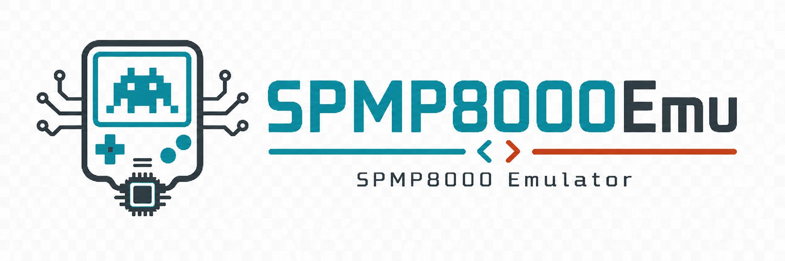

# SPMP8000 Emulator — A SPMP8000 game emulator written in Rust

<p align="center">
  
</p>

<p align="center">
  <a href="https://jiangxincode.github.io/SPMP8000Emu/"></a>
  <a href="https://github.com/jiangxincode/SPMP8000Emu/actions/workflows/ci.yml"></a>
  <a href="https://github.com/jiangxincode/SPMP8000Emu/releases/latest"></a>
  <a href="https://github.com/jiangxincode/SPMP8000Emu/releases"></a>
  <a href="https://sonarcloud.io/dashboard?id=jiangxincode_SPMP8000Emu"></a>
  <a href="LICENSE"></a>
</p>

A SPMP8000 game emulator written in Rust, supporting both standalone mode and
RetroArch integration.

SPMP8000 is a Sunplus multimedia SoC commonly found in portable gaming devices
(circa 2005–2011). Games use `.bin` files in the NGame1.0 format with an
ARM-based CPU and HLE system API.

## Features

- **NGame1.0 format support** — file loading, header parsing, DES decryption, LZ77 decompression
- **ARM CPU emulation** — full ARM instruction set execution
- **HLE system API** — emuIf, NativeGE, and eCos interfaces
- **Graphics rendering** — RGB565 to XRGB8888 conversion, 320×240 display
- **Audio emulation** — PCM audio output at 22050 Hz
- **Input handling** — keyboard input with configurable mappings
- **RetroArch integration** — libretro core for RetroArch frontend
- **Standalone mode** — minifb window with CLI
- **Cross-platform** — Windows, macOS, Linux, Android, iOS, webOS
- **Headless mode** — run without a window for testing and batch processing
- **Screenshot capture** — automated PNG screenshot generation

## Usage

### Standalone Mode

Download the latest binary from the
[Releases](https://github.com/jiangxincode/SPMP8000Emu/releases) page and run:

```bash
spmp8000-emu path/to/game.bin
```

See the [Standalone Emulator](docs/Standalone-Emulator.md) guide for
installation, keyboard controls, headless mode, screenshots, and all
command-line options.

### RetroArch Mode

Install the core and load a game through RetroArch's **Load Content** menu.

See the [RetroArch Core](docs/RetroArch-Core.md) guide for installation,
supported platforms, RetroPad mapping, and features.

## Building

Requires [Rust](https://www.rust-lang.org/tools/install) (stable).

### Standalone Mode

```bash
cargo build -p spmp8000-emu --release
cargo run -p spmp8000-emu --release -- path/to/game.bin
```

### Libretro Core (for RetroArch)

```bash
cargo build -p spmp8000-libretro --release
```

The binary is produced at `target/release/spmp8000.dll` (`.so` on Linux,
`.dylib` on macOS). Rename to `spmp8000_libretro.<ext>` before placing it in
RetroArch's `cores/` directory.

For Android cross-compilation, see [Android Libretro Core](docs/Android-Libretro-Core.md).
For iOS, see [iOS Libretro Core](docs/iOS-Libretro-Core.md).

## Architecture

```
crates/
├── spmp8000-core/            # Platform-independent emulator engine (library)
│   └── src/
│       ├── lib.rs            # Crate root
│       ├── emulator.rs       # Core emulator tying all components together
│       ├── arm_cpu.rs        # ARM CPU emulation
│       ├── memory.rs         # Memory map (RAM, VRAM, peripherals)
│       ├── bin_loader.rs     # NGame1.0 BIN file parser
│       ├── decompressor.rs   # DES decryption + LZ77 decompression
│       ├── renderer.rs       # RGB565 → XRGB8888 framebuffer conversion
│       ├── audio_engine.rs   # PCM audio output
│       ├── api.rs            # HLE system API (emuIf, NativeGE, eCos)
│       ├── input_handler.rs  # Button state management
│       ├── function_table.rs # HLE function trampolines
│       └── save_state.rs     # Save/load state
├── spmp8000-emu/             # Standalone binary (→ spmp8000-emu)
│   └── src/
│       └── main.rs           # Window loop, CLI, keyboard input
└── spmp8000-libretro/        # libretro cdylib (→ spmp8000_libretro.{dll,so,dylib})
    └── src/
        ├── lib.rs            # cdylib crate root
        └── libretro/         # libretro C API implementation
```

## Key Mappings (Standalone)

| Key | Button |
|-----|--------|
| Arrow Up/Down/Left/Right | D-pad |
| Z | O (A / Cross) |
| X | X (B / Circle) |
| Enter | START |
| Backspace | SELECT |
| Escape | Exit |

## Game Compatibility

The emulator supports games in NGame1.0 format (`.bin` files) for SPMP8000 and
SPCA556 chips. 44 out of 45 tested games load and render successfully.

| Status | Count |
|--------|-------|
| ✅ Title screen rendered | 38 |
| ⚠️ Blank frame (initialization incomplete) | 6 |
| ❌ Crash | 1 |

For the full game list with screenshots, see [Game Compatibility](docs/Game-Compatibility.md).

## Testing

Run the unit tests:

```bash
cargo test --workspace
```

There is also a smoke test that loads every available game, runs it for a number
of frames, and checks that the emulator neither panics nor produces a blank
frame. It needs the (non-distributed) game assets, so it is `#[ignore]`d by
default and only runs on demand:

```bash
# Uses <repo>/tmp/GameCollection by default, or set SPMP8000_GAME_DIR
cargo test -p spmp8000-core --test screenshot -- --ignored --nocapture
```

## Contributing

Contributions are welcome! Whether you're interested in fixing bugs, adding
features, improving documentation, or testing game compatibility, we'd love your
help. See [CONTRIBUTING.md](docs/CONTRIBUTING.md) for details.

## License

This project is licensed under the [BSD 3-Clause License](LICENSE).
