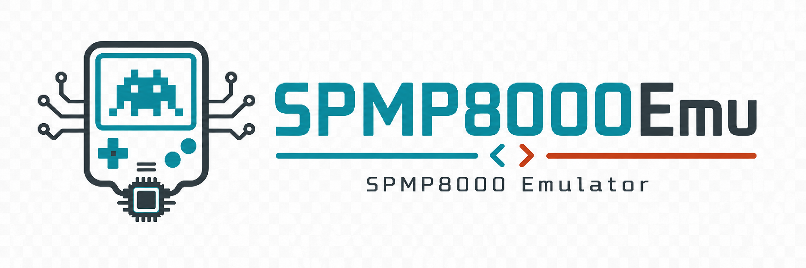
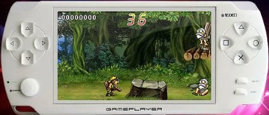
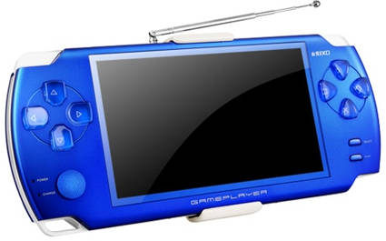
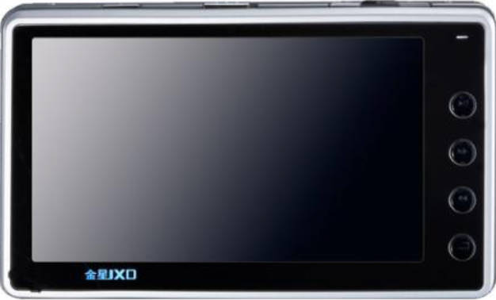
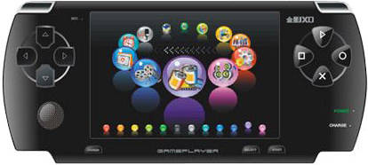
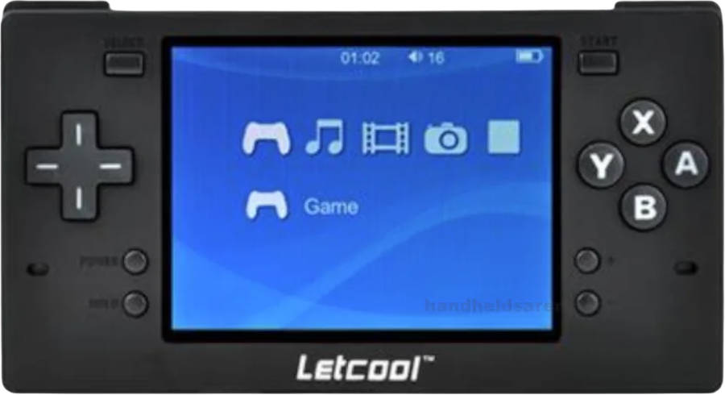
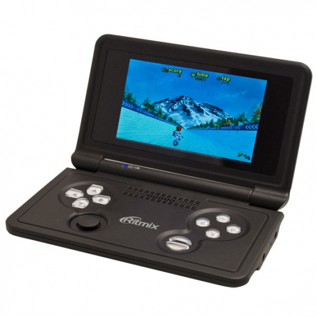

# SPMP8000 Emulator — A SPMP8000 game emulator written in Rust

<p align="center">
  
</p>

<p align="center">
  <a href="https://jiangxincode.github.io/SPMP8000Emu/"></a>
  <a href="https://github.com/jiangxincode/SPMP8000Emu/actions/workflows/ci.yml"></a>
  <a href="https://github.com/jiangxincode/SPMP8000Emu/releases/latest"></a>
  <a href="https://github.com/jiangxincode/SPMP8000Emu/releases"></a>
  <a href="https://sonarcloud.io/dashboard?id=jiangxincode_SPMP8000Emu"></a>
  <a href="LICENSE"></a>
  <a href="https://discord.gg/7XDdSrYD"></a>
  <a href="https://qm.qq.com/q/LAO7DKAWUC"></a>
</p>

A SPMP8000 game emulator written in Rust, supporting both standalone mode and
RetroArch integration.

SPMP8000 is a Sunplus multimedia SoC commonly found in portable gaming devices
(circa 2005–2011). Games use `.bin` files in the NGame1.0 format with an
ARM-based CPU and HLE system API.

## Features

- **NGame1.0 format support** — file loading, header parsing, DES decryption, LZ77/RLE decompression
- **ARM CPU emulation** — ARM mode instruction set (data processing, load/store, block transfer, branch, multiply, SVC)
- **HLE system API** — emuIf, NativeGE, and eCos interfaces with instruction-driven timing
- **Graphics rendering** — direct RGB565 and indexed-palette surfaces, sprite color-key transparency, 8 transformation modes, 320×240 display
- **Audio emulation** — WAV decoding and MIDI synthesis (16-channel, multi-voice) mixed to 22050 Hz stereo output
- **Input handling** — keyboard input with configurable mappings
- **RetroArch integration** — libretro core for RetroArch frontend
- **True reset** — rebuilds CPU, memory, HLE, graphics, audio, and input runtime state
- **Save states** — versioned, checksummed snapshots of the complete emulator runtime
- **Live core options** — adjust volume, O/X layout, and diagnostics without resetting the game
- **Memory and cheats** — inspect SPMP RAM/VRAM and freeze validated memory addresses or ARM registers
- **Standalone mode** — minifb window with CLI
- **Cross-platform** — Windows, macOS, Linux, Android, iOS, webOS
- **Headless mode** — run without a window for testing and batch processing
- **Screenshot capture** — automated PNG screenshot generation

## Usage

### Standalone Mode

Download the latest binary from the
[Releases](https://github.com/jiangxincode/SPMP8000Emu/releases) page and run:

```bash
spmp8000-emu path/to/game.bin
```

See the [Standalone Emulator](docs/Standalone-Emulator.md) guide for
installation, keyboard controls, headless mode, screenshots, and all
command-line options.

### RetroArch Mode

Install the core and load a game through RetroArch's **Load Content** menu.

See the [RetroArch Core](docs/RetroArch-Core.md) guide for installation,
supported platforms, RetroPad mapping, and features.

## Building

Requires [Rust](https://www.rust-lang.org/tools/install) (stable).

### Standalone Mode

```bash
cargo build -p spmp8000emu --release
cargo run -p spmp8000emu --release -- path/to/game.bin
```

### Libretro Core (for RetroArch)

```bash
cargo build -p spmp8000emu-libretro --release
```

The binary is produced at `target/release/spmp8000emu.dll`
(`libspmp8000emu.so` on Linux, `libspmp8000emu.dylib` on macOS). Rename it to
`spmp8000emu_libretro.<ext>` before placing it in RetroArch's `cores/`
directory.

For Android cross-compilation, see [Android Libretro Core](docs/Android-Libretro-Core.md).
For iOS, see [iOS Libretro Core](docs/iOS-Libretro-Core.md).

## Architecture

```
crates/
├── spmp8000emu-core/         # Platform-independent emulator engine (library)
│   └── src/
│       ├── lib.rs            # Crate root
│       ├── emulator.rs       # Core emulator tying all components together
│       ├── arm_cpu.rs        # ARM CPU emulation
│       ├── memory.rs         # Memory map (RAM, VRAM, peripherals)
│       ├── bin_loader.rs     # NGame1.0 BIN file parser
│       ├── decompressor.rs   # DES decryption + LZ77/RLE decompression
│       ├── renderer.rs       # RGB565 → XRGB8888 framebuffer conversion
│       ├── audio_engine.rs   # Audio source mixing and frame output
│       ├── audio_resource.rs # WAV decoding and MIDI synthesis
│       ├── input_handler.rs  # Button state management
│       ├── function_table.rs # HLE function trampolines
│       ├── save_state.rs     # Save-state data structures
│       ├── cheats.rs         # Memory and register cheat support
│       ├── config.rs         # Runtime emulator configuration
│       └── api/              # HLE system API (emuIf, NativeGE, eCos)
│           ├── mod.rs        # SVC dispatch and API state
│           ├── emu_graph.rs  # Graphics API (MCatch, emuIf graph)
│           ├── emu_sound.rs  # Sound API (emuIf sound)
│           ├── emu_key.rs    # Input API (emuIf + NativeGE keys)
│           ├── emu_fs.rs     # Filesystem API (emuIf + NativeGE fs)
│           └── native_ge.rs  # NativeGE resource/system API
├── spmp8000emu/              # Standalone binary (→ spmp8000-emu)
│   └── src/
│       ├── main.rs           # Window loop, CLI, keyboard input
│       └── audio_output.rs   # cpal-based audio output with resampling
└── spmp8000emu-libretro/     # libretro cdylib (→ spmp8000emu_libretro.{dll,so,dylib})
    └── src/
        ├── lib.rs            # cdylib crate root
        └── libretro/         # libretro C API implementation
```

## Key Mappings (Standalone)

| Key | Button |
|-----|--------|
| Arrow Up/Down/Left/Right | D-pad |
| Z | O (A / Cross) |
| X | X (B / Circle) |
| Enter | START |
| Backspace | SELECT |
| Escape | Exit |

## Known SPMP8XXX Devices

Handheld gaming devices based on SunPlus SPMP8XXX chips that can run NGame1.0 games:

| Chip | Manufacturer | Device | Image | Region | Links |
|------|--------------|--------|-------|--------|-------|
| SPMP8010A | 金星 (JXD) | JXD1000 |  | China | [Official](https://jxd.hk/products.asp?id=554&selectclassid=009002001) · [Wiki](https://jxd.fandom.com/wiki/Jxd1000) · [Video](https://www.bilibili.com/video/BV1kR57zzEGQ) |
| SPMP8010A | 金星 (JXD) | JXD2000 |  | China | [Official](https://jxd.hk/products.asp?id=555&selectclassid=009002001) |
| SPMP8000? | 金星 (JXD) | JXD980 |  | China | [Baidu](https://baike.baidu.com/item/%E9%87%91%E6%98%9FJXD980/8365407) |
| SPMP8000? | 金星 (JXD) | JXD300 |  | China | [Baidu](https://baike.baidu.com/item/%E9%87%91%E6%98%9FJXD300/312367) · [Video](https://www.youtube.com/watch?v=-J2uHjPQ2VQ) |
| SPMP8000? | 金星 (JXD) | JXD206 |  | China | [Blog](https://surajbkmshah.wordpress.com/2010/05/05/frm-pro-v3-3-for-pmp8000-flashfile-procedure-here/) |
| SPMP8000 | Letcool | N350JP |  | China | [Handhelds Arena](https://handheldsarena.com/devices/letcool/n350jp/) |
| SPMP8010 | Ritmix | RZX-40 |  | Russia | [Official](http://old.ritmixrussia.ru/products/rzx-40) |

> **Note**: Devices marked with "?" have unconfirmed chip models.

## Game Compatibility

The emulator supports games in NGame1.0 format (`.bin` files) for SPMP8000 and
SPCA556 chips. All 45 tested games now load without crashing, and 41 render a
recognizable title or startup screen.

| Status | Count |
|--------|-------|
| ✅ Title/start screen rendered | 41 |
| ⚠️ Blank or corrupt frame | 4 |
| ❌ Crash | 0 |

For the full game list with screenshots, see [Game Compatibility](docs/Game-Compatibility.md).

## Testing

Run the unit tests:

```bash
cargo test --workspace
```

There is also a smoke test that loads every available game, runs it for a number
of frames, and checks that the emulator neither panics nor produces a blank
frame. It needs the (non-distributed) game assets, so it is `#[ignore]`d by
default and only runs on demand:

```bash
# Uses <repo>/tmp/spmp8000_game by default, or set SPMP8000_GAME_DIR
cargo test -p spmp8000emu-core --test screenshot -- --ignored --nocapture
```

To refresh the compatibility screenshots, run:

```powershell
pwsh scripts/batch-screenshots.ps1
```

The script rebuilds the release executable before capturing, uses 300 frames by
default, and uses tuned capture points for games with shorter title-screen
windows. Pass `-Frames <count>` to use one explicit frame count for every game,
or `-Binary <path>` to capture with an existing executable without rebuilding
it.

## Contributing

Contributions are welcome! Whether you're interested in fixing bugs, adding
features, improving documentation, or testing game compatibility, we'd love your
help. See [CONTRIBUTING.md](docs/CONTRIBUTING.md) for details.

## License

This project is licensed under the [BSD 3-Clause License](LICENSE).
