# Game Compatibility

SPMP8000 games use the NGame1.0 binary format (`.bin` files) for the Sunplus
SPMP8000 / SPCA556 chips. Each game was tested by running the emulator for 300
frames (10 seconds at 30fps) and checking for crashes or blank frames.

## Summary

| Status | Count |
|--------|-------|
| ✅ Pass (title screen rendered) | 38 |
| ⚠️ Warn (blank frame) | 6 |
| ❌ Fail (crash) | 1 |
| **Total** | **45** |

## Game List

| # | Game | 中文名称 | File | Screenshot | Status |
|---|------|----------|------|------------|--------|
| 1 | BattleGround | 坦克大战 | tmp/GameCollection/BattleGround-1.2.2_EN.bin | 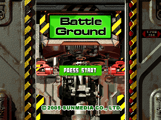 | ✅ Pass |
| 2 | BattleGround | 坦克大战 | tmp/GameCollection/BattleGround-1.2.2_P_new.bin |  | ✅ Pass |
| 3 | BumperCars | 碰碰车 | tmp/GameCollection/BumperCars-1.0.10_P_new.bin |  | ✅ Pass |
| 4 | BurningTetris | 俄罗斯方块 | tmp/GameCollection/BurningTetris/BurningTetris-2.1.1_P_new.bin | 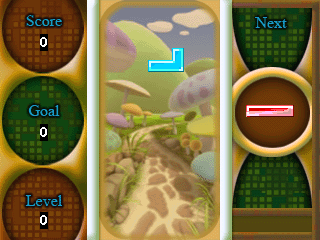 | ⚠️ Warn |
| 5 | BurningTetris | 俄罗斯方块 | tmp/GameCollection/BurningTetris/BurningTetris-2.1.2_EN.bin | 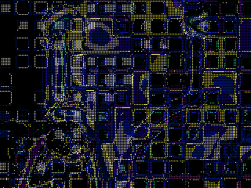 | ⚠️ Warn |
| 6 | Crazy Racer | 疯狂赛车 | tmp/GameCollection/Crazy Racer-1.3.4_EN.bin |  | ✅ Pass |
| 7 | DeepKiller | 深度攻击 | tmp/GameCollection/DeepKiller-1.2.6_P_new.bin | 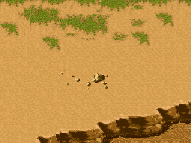 | ✅ Pass |
| 8 | DeepKiller | 深度攻击 | tmp/GameCollection/DeepKiller-1.2.6_SPCA8000_320x240_EN_P_new.bin | 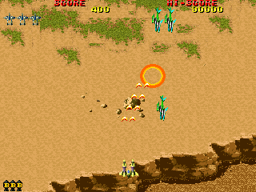 | ✅ Pass |
| 9 | DeepTreasures | 深海寻宝 | tmp/GameCollection/DeepTreasures-1.0.7_P_new_CHS.bin | 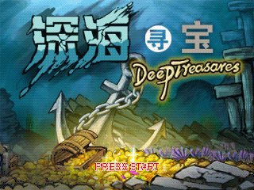 | ✅ Pass |
| 10 | DeepTreasures | 深海寻宝 | tmp/GameCollection/DeepTreasures_JXD1000.BIN | 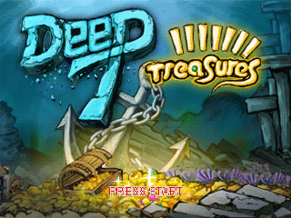 | ✅ Pass |
| 11 | EggSwallower | 贪吃蟹 | tmp/GameCollection/EggSwallower-1.2.4_EN.bin | 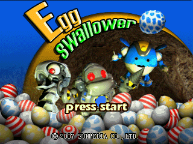 | ✅ Pass |
| 12 | EggSwallower | 贪吃蟹 | tmp/GameCollection/EggSwallower-1.2.4_P_new.bin |  | ✅ Pass |
| 13 | ElementalSpirit | 元素精灵 | tmp/GameCollection/ElementalSpirit/ElementalSpirit-0.2.2_EN.bin |  | ⚠️ Warn |
| 14 | ElementalSpirit | 元素精灵 | tmp/GameCollection/ElementalSpirit/ElementalSpirit-0.2.2_P_new.bin | 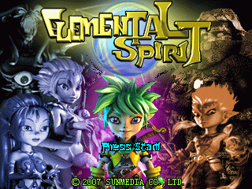 | ⚠️ Warn |
| 15 | FruitParty | 水果派对 | tmp/GameCollection/FruitParty-1.0.7_EN.bin |  | ✅ Pass |
| 16 | FruitParty | 水果派对 | tmp/GameCollection/FruitParty-1.0.7_P_new.bin |  | ✅ Pass |
| 17 | GhostWorm | 小虫快跑 | tmp/GameCollection/GhostWorm-1.4.3_P_new.bin |  | ✅ Pass |
| 18 | GoBang | 五子棋 | tmp/GameCollection/GoBang-1.0.5_P_new.bin |  | ✅ Pass |
| 19 | GoBang | 五子棋 | tmp/GameCollection/GoBang-1.0.6_P_new.bin |  | ✅ Pass |
| 20 | GoBang | 五子棋 | tmp/GameCollection/GoBang-1.0.7_P_new.bin |  | ✅ Pass |
| 21 | Gobang | 五子棋 | tmp/GameCollection/Gobang-1.0.7_EN.bin | 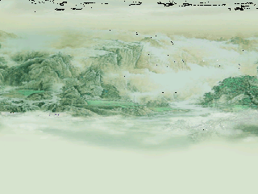 | ✅ Pass |
| 22 | Incoming | 入侵 | tmp/GameCollection/Incoming-1.2.5_EN.bin | 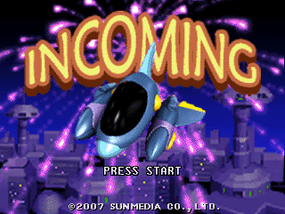 | ✅ Pass |
| 23 | Incoming | 入侵 | tmp/GameCollection/Incoming-1.2.5_P_new.bin |  | ✅ Pass |
| 24 | JetGirl | 滑雪少女 | tmp/GameCollection/JetGirl-1.0.9_EN.bin |  | ✅ Pass |
| 25 | JetGirl | 滑雪少女 | tmp/GameCollection/JetGirl-1.0.9_P_new.bin | 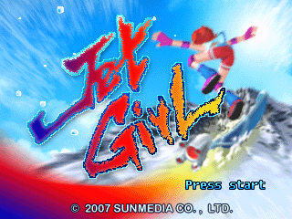 | ✅ Pass |
| 26 | Lucky21 | 二十一点 | tmp/GameCollection/Lucky21-1.2.7_EN.bin |  | ✅ Pass |
| 27 | Lucky21 | 二十一点 | tmp/GameCollection/Lucky21-1.2.7_P_new.bin |  | ✅ Pass |
| 28 | MahJong | 雀神 | tmp/GameCollection/MahJong-1.1.7_P_new.bin | 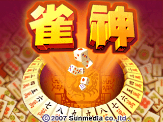 | ✅ Pass |
| 29 | MoleHunting | 打地鼠 | tmp/GameCollection/MoleHunting-1.0.6_P_new.bin |  | ✅ Pass |
| 30 | Orchard | 果园对对碰 | tmp/GameCollection/Orchard-1.2.3_EN.bin | 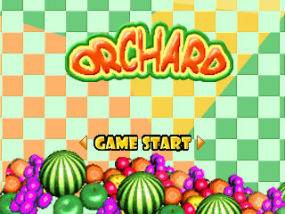 | ✅ Pass |
| 31 | Orchard | 果园对对碰 | tmp/GameCollection/Orchard-1.2.3_P_new.bin | 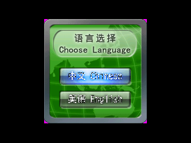 | ✅ Pass |
| 32 | Paradise777 | 老虎机 | tmp/GameCollection/Paradise777-1.2.6_EN.bin | 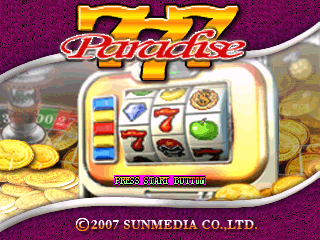 | ✅ Pass |
| 33 | Paradise777 | 老虎机 | tmp/GameCollection/Paradise777-1.2.6_P_new.bin | 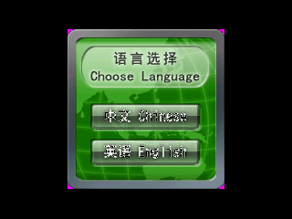 | ⚠️ Warn |
| 34 | Racer | 疯狂赛车 | tmp/GameCollection/Racer-1.3.4_P_new.bin |  | ✅ Pass |
| 35 | Racer | 疯狂赛车 | tmp/GameCollection/Racer-1.3.4-CHS_P_new.bin |  | ✅ Pass |
| 36 | ShowHand | 梭哈 | tmp/GameCollection/ShowHand-1.2.6_P_new.bin |  | ✅ Pass |
| 37 | SmartBlocks | 智力拼图 | tmp/GameCollection/SmartBlocks-1.4.2_EN.bin | 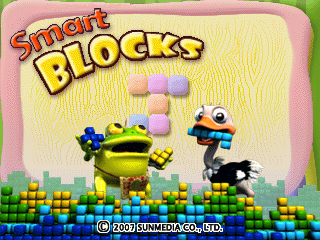 | ✅ Pass |
| 38 | SmartBlocks | 智力拼图 | tmp/GameCollection/SmartBlocks-1.4.2_P_new.bin |  | ✅ Pass |
| 39 | SpaceBattleBall | 太空弹珠 | tmp/GameCollection/SpaceBattleBall-1.0.4_P_new.bin | 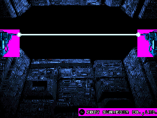 | ✅ Pass |
| 40 | SpaceBattleBall | 太空弹珠 | tmp/GameCollection/SpaceBattleBall-1.0.4_P_new_en.bin |  | ✅ Pass |
| 41 | DOOM | 毁灭战士 | tmp/GameCollection/Heretic/doom.bin | 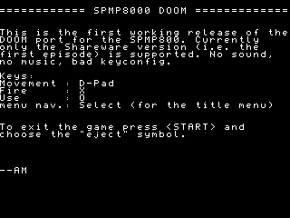 | ⚠️ Warn |
| 42 | Heretic | 异教徒 | tmp/GameCollection/spmp8k-Heretic/spmp8k-Heretic_r1.bin |  | ⚠️ Warn |
| 43 | Quake | 雷神之锤 | tmp/GameCollection/spmp8k-quake/spmp8k-Quake_r1.bin |  | ⚠️ Warn |
| 44 | DOOM (spmp8k) | 毁灭战士 | tmp/GameCollection/spmp8k-doom/spmp8k-doom_r3.bin |  | ⚠️ Warn |
| 45 | 0quake | 雷神之锤 | tmp/GameCollection/Quake/0quake.bin | — | ❌ Fail |
